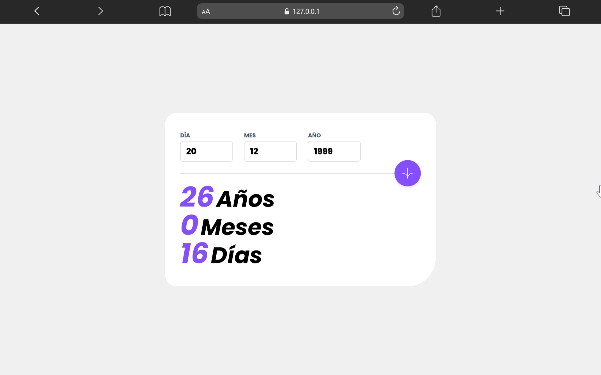
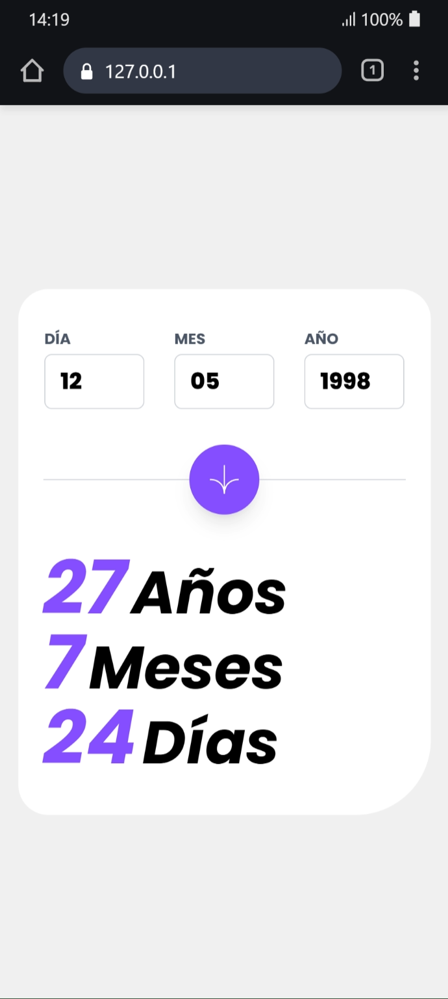
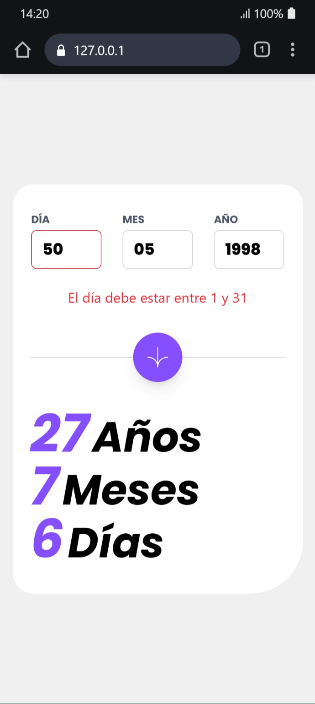

# 📅 Calculadora de Edad

Una aplicación web elegante y funcional para calcular tu edad exacta en años, meses y días. Desarrollada con HTML, CSS (Tailwind CSS) y JavaScript vanilla.



Ingresa tu fecha de nacimiento y obtén instantáneamente tu edad exacta desglosada en años, meses y días. Incluye validación completa de fechas y manejo de errores intuitivo.

## ✨ Características

- ✅ Validación completa de fechas (días, meses y años)
- 🎯 Cálculo preciso de edad en años, meses y días
- 🚫 Prevención de fechas futuras e inválidas
- 📱 Diseño responsive (mobile-first)
- ♿ Accesibilidad con atributos ARIA
- 🎨 Interfaz moderna con Tailwind CSS
- ⚡ Feedback visual instantáneo para errores

## 🖼️ Capturas de pantalla

### Vista Desktop


### Vista Mobile


### Estado de error


## 🛠️ Tecnologías utilizadas

- **HTML5** - Estructura semántica
- **Tailwind CSS** - Estilización mediante utilidades
- **JavaScript ES6+** - Lógica y validación
- **Fuente Poppins** - Tipografía

## 🚀 Instalación y uso del proyecto

Este proyecto utiliza **Tailwind CSS** mediante su CLI.

### 📦 Requisitos previos

- Tener instalado **Node.js** (versión 14 o superior, incluye npm)

### 🔧 Pasos para iniciar el proyecto

**Instalar las dependencias**
```bash
   npm install
```

**Compilar Tailwind CSS en modo watch** (para desarrollo)
```bash
   npx @tailwindcss/cli -i ./src/input.css -o ./src/output.css --watch
```

## 🎯 Funcionalidades

### Validaciones
- ✔️ Campos obligatorios y rangos válidos (día: 1-31, mes: 1-12, año: desde 1900)
- ✔️ Verificación de fechas reales (considera meses con diferentes días)
- ✔️ Prevención de fechas futuras
- ✔️ Solo acepta números

## 💻 Uso

1. Ingresa tu fecha de nacimiento (DD/MM/AAAA)
2. Haz clic en el botón de flecha o presiona Enter
3. Visualiza tu edad desglosada en años, meses y días
